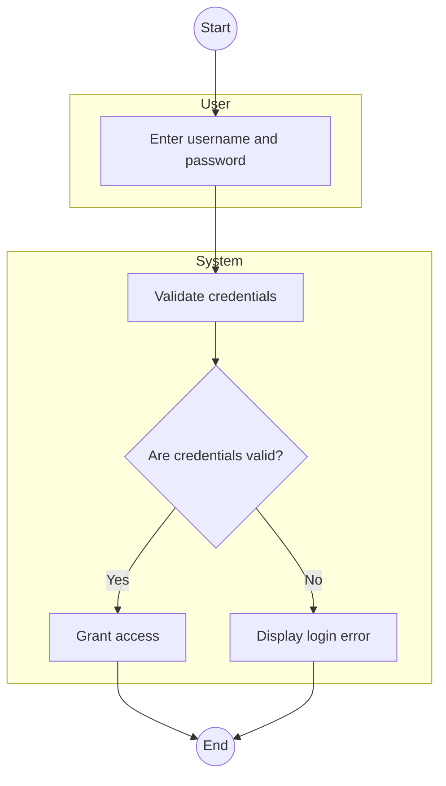
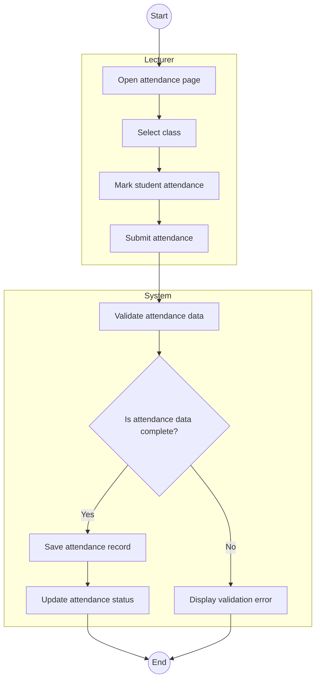
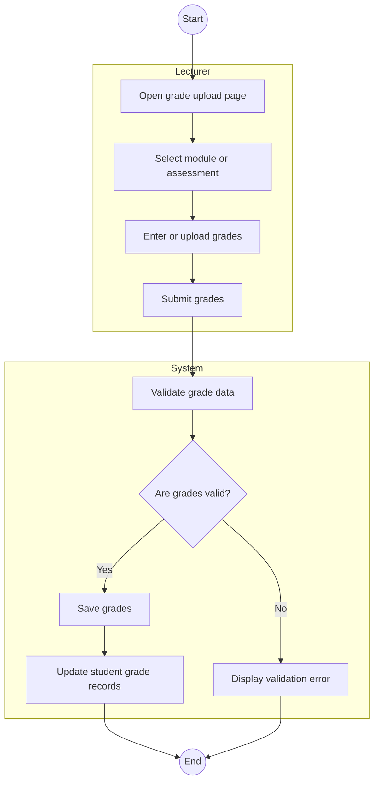
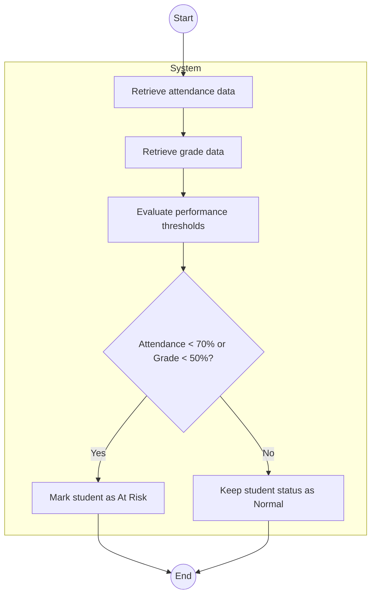
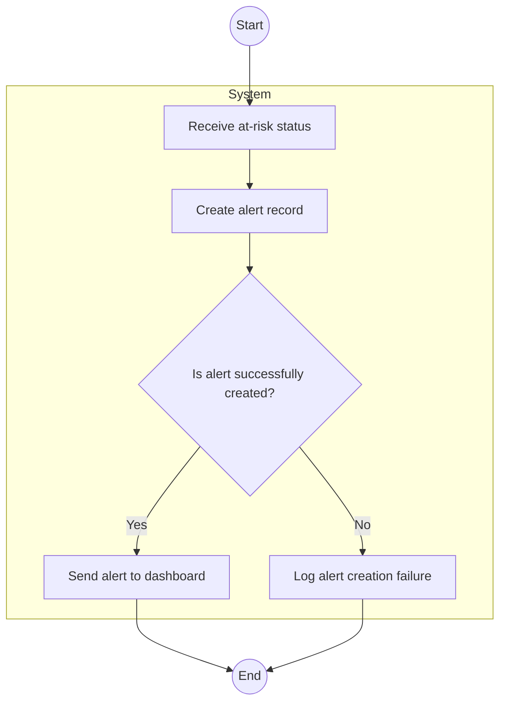
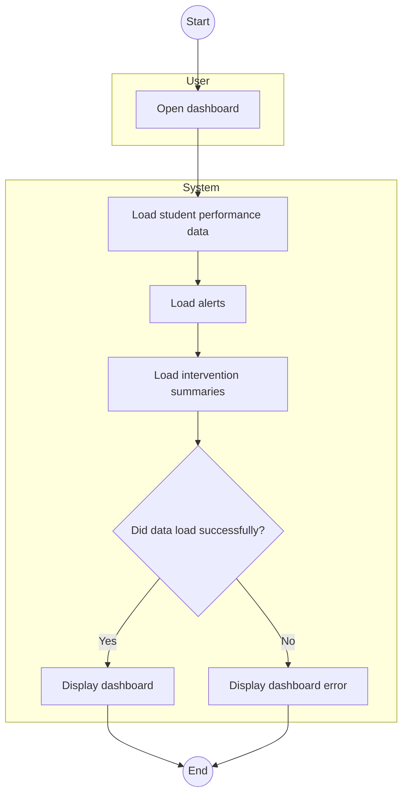
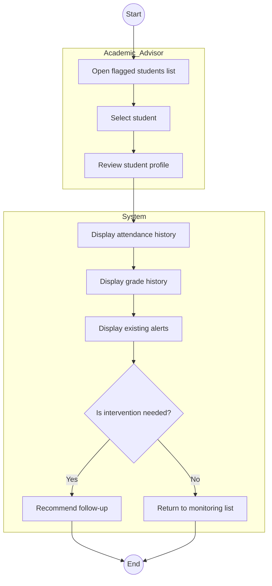
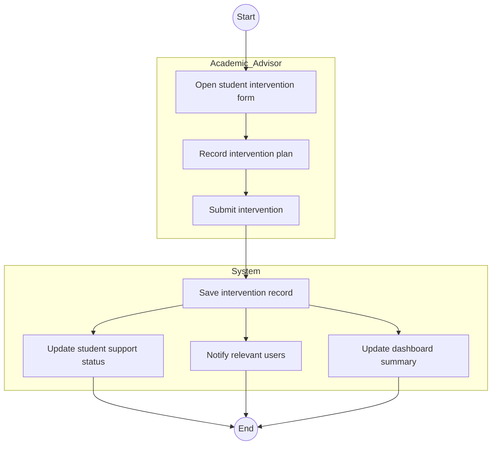

# Activity Diagrams
## Student Early Warning System

---

### 1. User Login Workflow

Explanation

This workflow models how users log into the system. The process starts when the user enters login credentials. The system validates the details and checks whether they are correct. If the credentials are valid, the user is granted access. If not, an error is displayed and the process ends.

Stakeholder Concerns Addressed

Supports secure access for all users.
Reduces unauthorized access attempts.
Improves usability by providing immediate feedback for invalid credentials.

Mapping to Requirements

FR1: User Authentication
US-001 / Sprint tasks related to login and access control

### 2. Record Attendance Workflow

Explanation

This workflow shows how a lecturer records attendance for a class. The lecturer opens the attendance page, selects a class, marks student attendance, and submits it. The system validates the data. If complete, it saves the record and updates attendance status. If incomplete, it displays an error.

Stakeholder Concerns Addressed

Reduces manual tracking errors for lecturers.
Ensures attendance data is captured accurately.
Supports later risk analysis based on attendance.

Mapping to Requirements

FR3: Attendance Recording
FR10: Data Storage
US-003: Record attendance

### 3. Upload Grades Workflow

Explanation

This workflow describes the process of uploading student grades. The lecturer selects the relevant module or assessment, enters or uploads grades, and submits them. The system validates the information. If valid, the grades are stored and the student records are updated. If not, an error is shown.

Stakeholder Concerns Addressed

Helps lecturers maintain updated student performance data.
Reduces grading errors.
Ensures current data is available for monitoring and risk detection.

Mapping to Requirements

FR4: Grade Management
FR10: Data Storage
US-004: Upload grades

### 4. Risk Detection Workflow

Explanation

This workflow shows how the system determines whether a student is at risk. The system retrieves attendance and grade data, evaluates predefined thresholds, and makes a decision. If attendance is below 70% or grades are below 50%, the student is marked as at risk. Otherwise, the normal status remains.

Stakeholder Concerns Addressed

Supports early identification of struggling students.
Reduces dependence on manual monitoring.
Helps advisors intervene before performance worsens.

Mapping to Requirements

FR5: Risk Detection
US-009: Detect academic risk

### 5. Generate Alert Workflow

Explanation

This workflow begins after a student has been flagged as at risk. The system creates an alert record and checks whether it was created successfully. If successful, the alert is pushed to the dashboard. If not, the failure is logged for later handling.

Stakeholder Concerns Addressed

Ensures lecturers and advisors are notified quickly.
Improves visibility of at-risk students.
Supports timely decision-making and follow-up.

Mapping to Requirements

FR7: Alert Notification
FR6: Dashboard Display
US-010: Generate alerts

### 6. View Dashboard Workflow

Explanation

This workflow explains how a user views the dashboard. When the dashboard is opened, the system loads student performance data, alerts, and intervention summaries. If the data loads successfully, the dashboard is displayed. If not, an error is shown.

Stakeholder Concerns Addressed

Gives lecturers and advisors a centralized view of student progress.
Improves usability through quick access to academic monitoring information.
Supports decision-making with summarized data.

Mapping to Requirements

FR6: Dashboard Display
FR8: Student View Access where relevant
US-005: View dashboard

### 7. Monitor Flagged Students Workflow

Explanation

This workflow describes how an academic advisor monitors students who have been flagged by the system. The advisor opens the flagged list, selects a student, and reviews the student’s academic profile. The system displays attendance history, grade history, and alerts. The advisor then decides whether intervention is needed.

Stakeholder Concerns Addressed

Helps advisors review students systematically.
Supports early support for struggling students.
Reduces the risk of missing critical academic warning signs.

Mapping to Requirements

FR9: Advisor Monitoring
FR6: Dashboard Display
US-006: Monitor flagged students

### 8. Provide Intervention Workflow

Explanation

This workflow shows how an advisor provides intervention to a student. The advisor opens the intervention form, records the support plan, and submits it. After submission, the system performs parallel actions: it saves the record, updates the student’s support status, notifies relevant users, and updates the dashboard summary.

Stakeholder Concerns Addressed

Ensures interventions are formally recorded.
Parallel actions improve responsiveness by updating multiple parts of the system at once.
Supports advisor efficiency and better coordination.

Mapping to Requirements

FR9: Advisor Monitoring
FR6: Dashboard Display
FR7: Alert Notification
US-007: Provide intervention

### Activity Diagrams Traceability

| Workflow | Functional Requirements | User Stories | Sprint Tasks |
|---|---|---|---|
| User Login | FR1 | US-001 | T-001 |
| Record Attendance | FR3, FR10 | US-003 | T-002 |
| Upload Grades | FR4, FR10 | US-004 | T-003 |
| Risk Detection | FR5 | US-009 | T-004 |
| Generate Alerts | FR6, FR7 | US-010 | T-005 |
| View Dashboard | FR6, FR8 | US-005 | T-006 |
| Monitor Students | FR6, FR9 | US-006 | T-006 |
| Provide Intervention | FR6, FR7, FR9 | US-007 | T-004 |