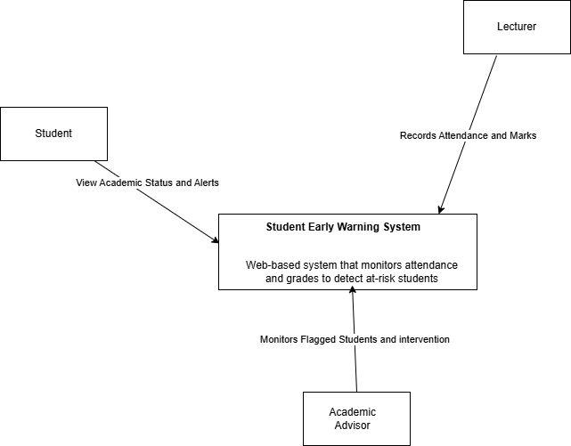
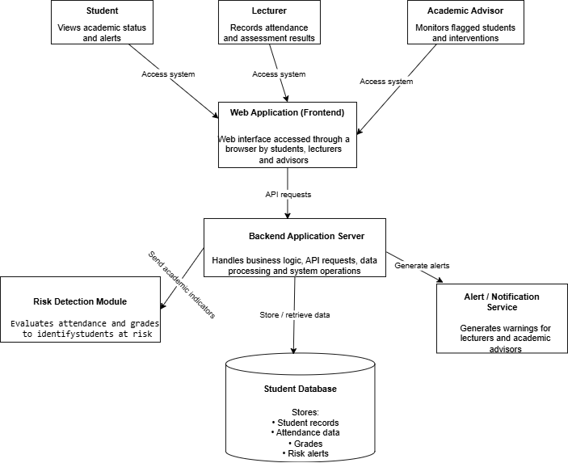
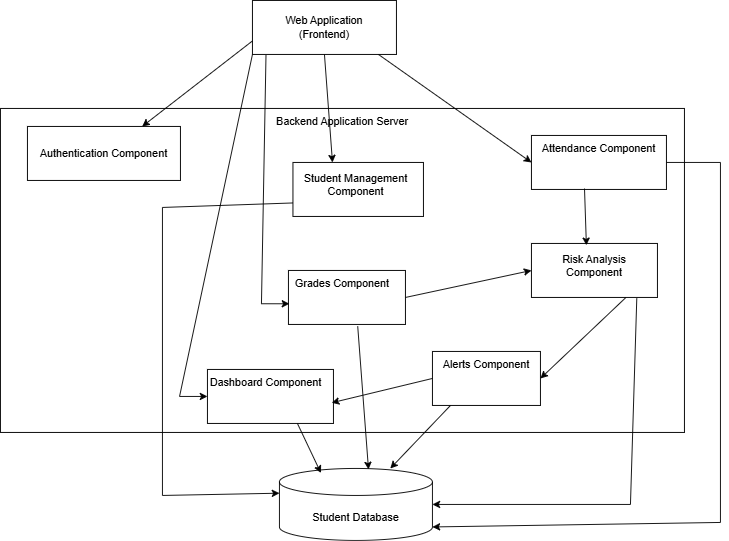

# System Architecture
## Student Early Warning System for Academic Risk Detection

---

## 1. Project Title
**Student Early Warning System for Academic Risk Detection**

---

## 2. Domain
**Higher Education / Academic Performance Monitoring Systems**

The Student Early Warning System operates within the higher education domain, where institutions need effective tools to monitor student academic performance and identify students who may require support. The system is designed to assist lecturers and academic advisors in tracking attendance and assessment performance so that academically at-risk students can be identified early.

---

## 3. Problem Statement
In many higher education institutions, students who are experiencing academic difficulties are often identified too late for meaningful intervention. Manual monitoring of attendance and assessment performance can be inefficient, inconsistent, and difficult to manage, especially in large classes.

The Student Early Warning System addresses this problem by collecting academic indicators such as attendance and grades, analyzing them against predefined thresholds, and alerting lecturers and academic advisors when a student is at risk. This enables timely intervention and improved student support.

---

## 4. Individual Project Scope
This project focuses on the design of a simplified web-based Student Early Warning System that is feasible for a single developer. The system includes attendance tracking, grade recording, student performance monitoring, risk detection using predefined rules, and alert dashboards for lecturers and academic advisors.

The project excludes advanced machine learning models, integration with existing institutional systems, mobile applications, and real-time large-scale analytics pipelines. These exclusions keep the project realistic and manageable while still demonstrating a complete end-to-end architecture.

---

## 5. Architectural Overview
The Student Early Warning System follows a simple web-based architecture made up of the following major parts:

- **Users**: Students, Lecturers, and Academic Advisors
- **Web Application**: Provides the user interface through a web browser
- **Backend Application Server**: Handles business logic and system processing
- **Risk Detection Module**: Evaluates academic data and identifies at-risk students
- **Database**: Stores student records, attendance data, grades, and alerts
- **Notification/Alert Component**: Displays alerts to users through the dashboard

This architecture supports the complete flow of capturing academic data, evaluating risk, and allowing academic staff to monitor and respond to student performance issues.

---

## 6. C4 Model - System Context Diagram
The context diagram illustrates how students, lecturers, and academic advisors interact with the Student Early Warning System to monitor academic performance and identify at-risk students.

## 7. C4 Model - Container Diagram
The container diagram illustrates the major technical components of the Student Early Warning System. Users interact with the system through a web application interface. The backend application server processes user requests and manages system logic. Academic data is stored in a relational database, while the risk detection module analyzes student performance indicators to identify at-risk students. The alert service generates notifications that allow lecturers and academic advisors to monitor and support students who may require intervention. 

## 8. C4 Model - Component Diagram
The component diagram illustrates the internal structure of the backend application server. The backend contains several components responsible for managing different parts of the system including authentication, student records, attendance tracking, grade management, risk analysis, alerts, and dashboard presentation. These components interact with the central student database to store and retrieve academic data. The risk analysis component evaluates attendance and grade information to identify students who may be academically at risk, while the alerts component generates notifications that are displayed through the dashboard for lecturers and academic advisors.

