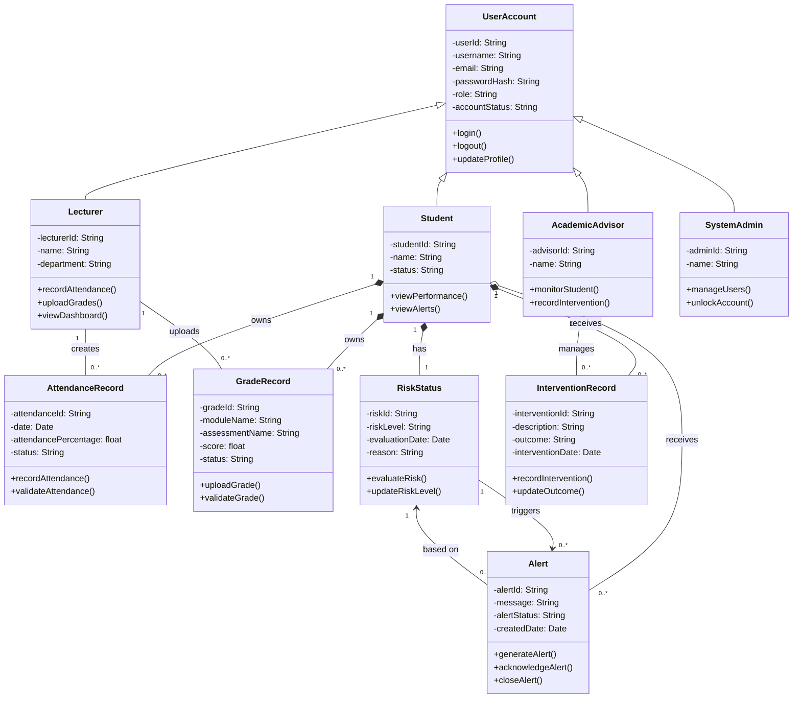

# Class Diagram
## Student Early Warning System

---

Explanation

This class diagram models the main structure of the Student Early Warning System.

Inheritance

UserAccount is used as a parent class for:

Student
Lecturer
AcademicAdvisor
SystemAdmin

This avoids repeating shared account details such as username, email, password, and account status.

Composition

Composition is used where records depend strongly on the student:

A Student owns many AttendanceRecord objects.
A Student owns many GradeRecord objects.
A Student has one RiskStatus.
A Student may receive many InterventionRecord objects.

This means these academic records are part of the student’s academic profile.

Aggregation

Aggregation is used between Student and Alert because alerts are related to the student but may also be stored independently for audit and reporting purposes.

Key Design Decision

The risk detection logic is separated into the RiskStatus class instead of being placed directly inside the Student class. This improves maintainability because the risk rules can be updated without changing the student profile structure.

Alignment with Previous Assignments

This class diagram aligns with:

Functional requirements from Assignment 4
Use cases from Assignment 5
User stories and sprint planning from Assignment 6
State and activity diagrams from Assignment 8

It supports core system features such as attendance tracking, grade management, risk detection, alert generation, and academic intervention.