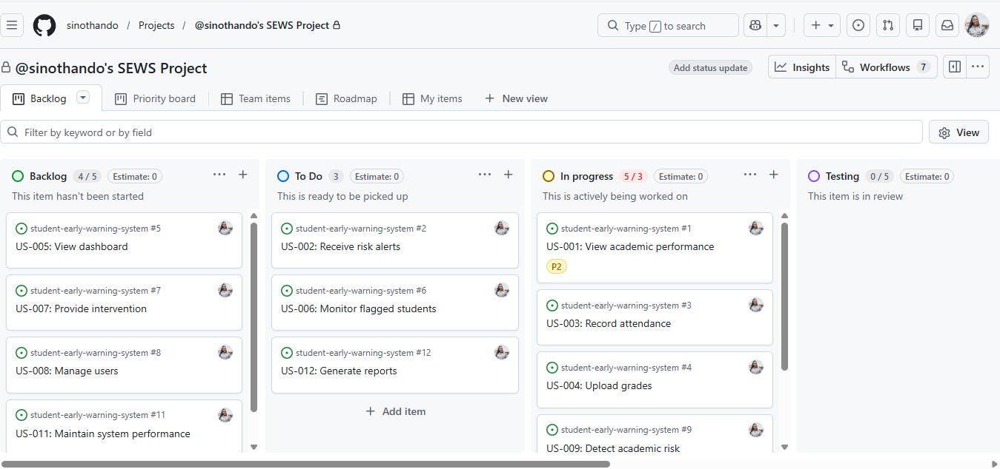
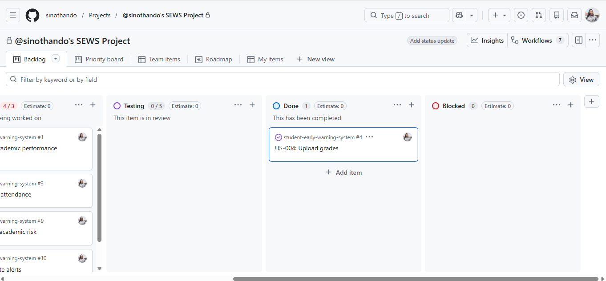
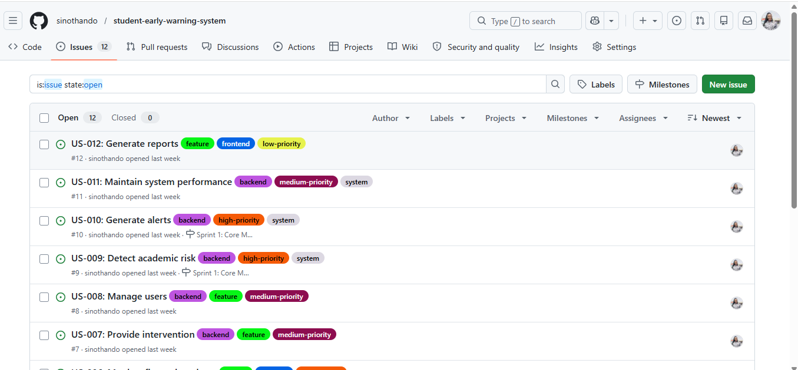

# Kanban Board Explanation
## Student Early Warning System

---

## What is a Kanban Board?

A Kanban board is a visual project management tool used to track tasks across different stages of a workflow. It organizes work into columns that represent the progress of tasks, allowing teams to monitor development in real time.

---

## How the Board Visualizes Workflow

The Kanban board created for the Student Early Warning System clearly represents the workflow using the following columns:

- **Backlog** – Tasks that have been identified but not yet started  
- **To Do** – Tasks that are ready to be worked on  
- **In Progress** – Tasks currently being developed  
- **Testing** – Tasks that are completed and under review before finalization  

From the screenshot, tasks such as:
- *US-001: View academic performance*
- *US-003: Record attendance*
- *US-004: Upload grades*
- *US-009: Detect academic risk*

are actively being worked on in the **In Progress** column, showing real-time task movement.

---

## Work-in-Progress (WIP) Management

The board helps manage work-in-progress by limiting how many tasks are actively being worked on at a time.

For example:
- The **In Progress** column contains only a few active tasks
- Tasks are not all started at once, preventing overload

This ensures that focus is maintained and work is completed efficiently without bottlenecks.

---

## Use of Issues, Labels, and Assignments

The Kanban board integrates GitHub Issues, which represent user stories from Assignment 6. Each task is:

- **Linked to an issue** (e.g., US-001, US-003)
- **Assigned to a user** (visible in the screenshot)
- **Categorized using labels** such as priority and type

This improves organization and ensures accountability for each task.

---

## Support for Agile Principles

The Kanban board supports Agile methodology by:

- Providing **continuous workflow visibility**
- Allowing tasks to move flexibly between stages
- Supporting **incremental development**
- Enabling quick adaptation to changes

The use of columns such as *Backlog*, *To Do*, and *In Progress* reflects real-world Agile practices used in software development teams.

---

## Kanban Board Screenshot

## Conclusion

The Kanban board effectively visualizes the development process of the Student Early Warning System. It ensures that tasks are organized, progress is tracked, and work is managed efficiently. By integrating GitHub Issues and using structured workflow stages, the board demonstrates a practical implementation of Agile project management.