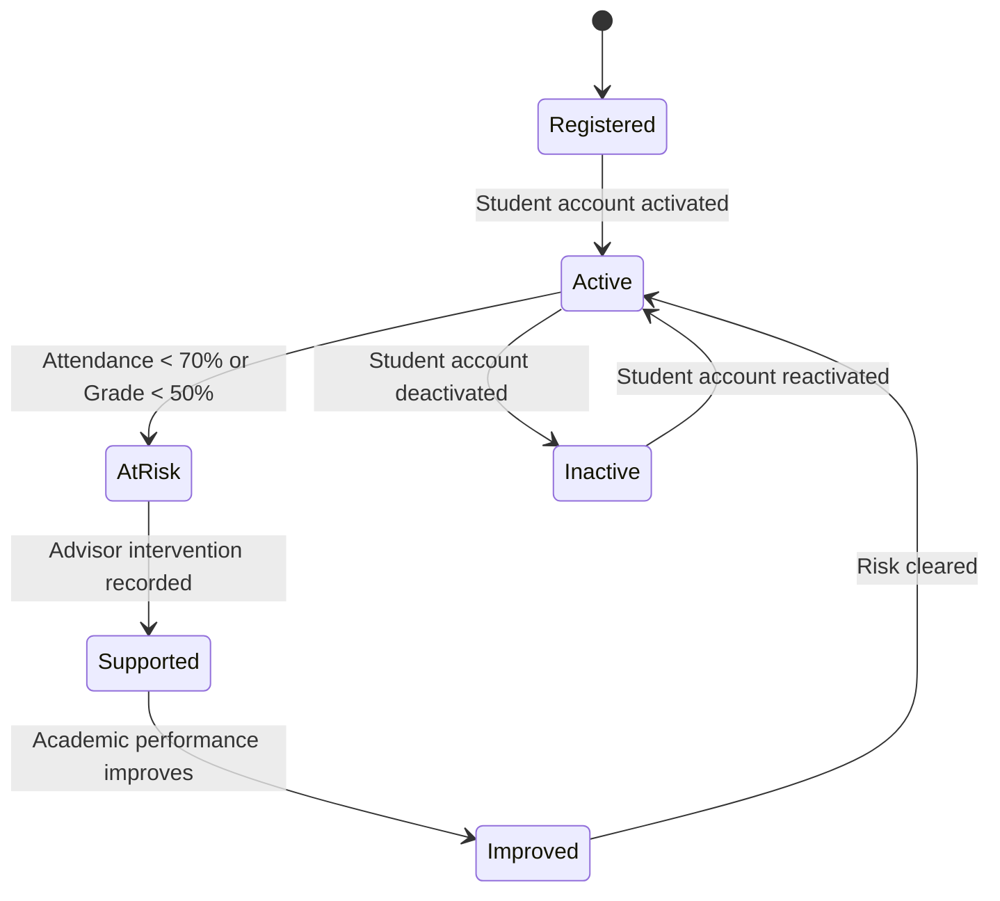
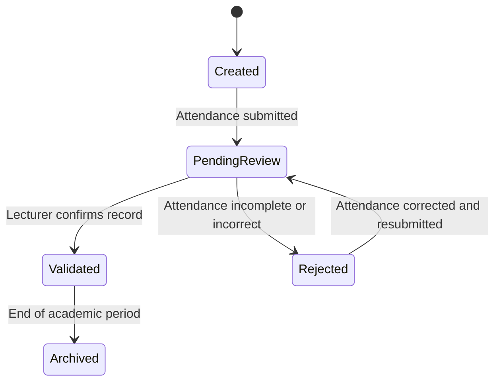
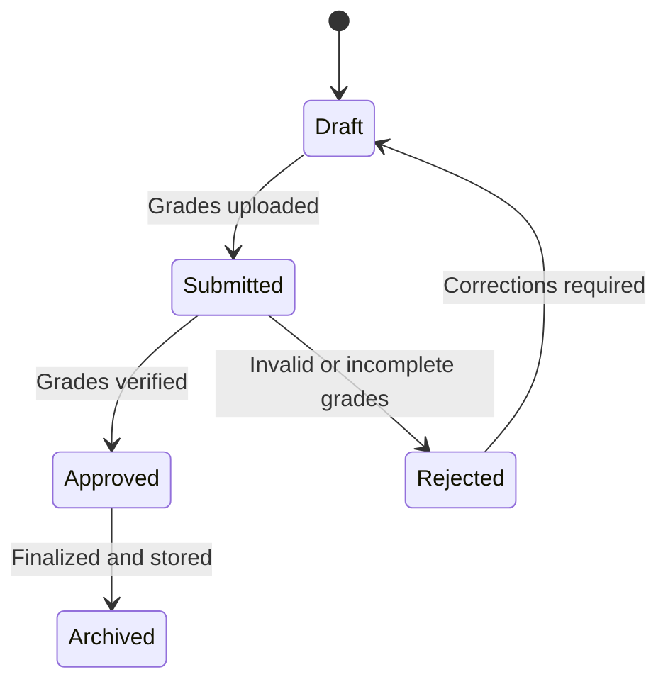
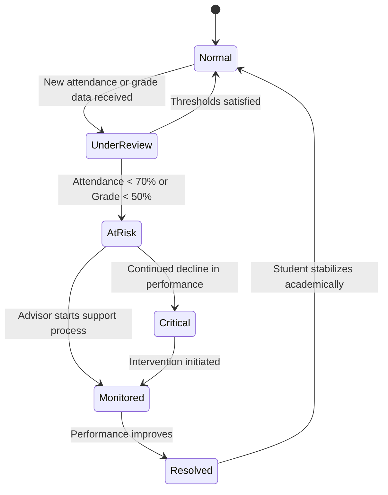
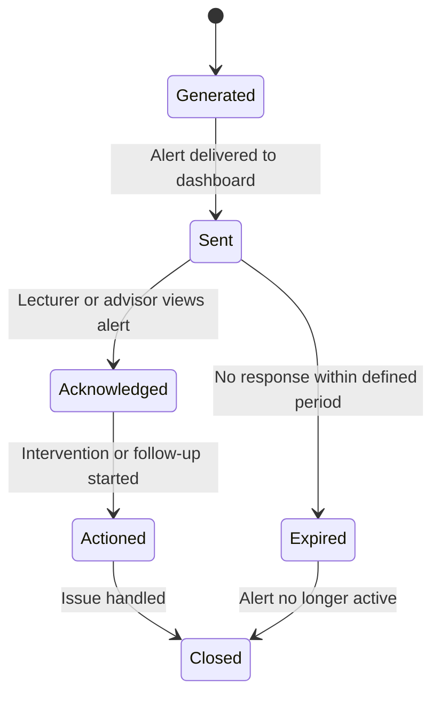
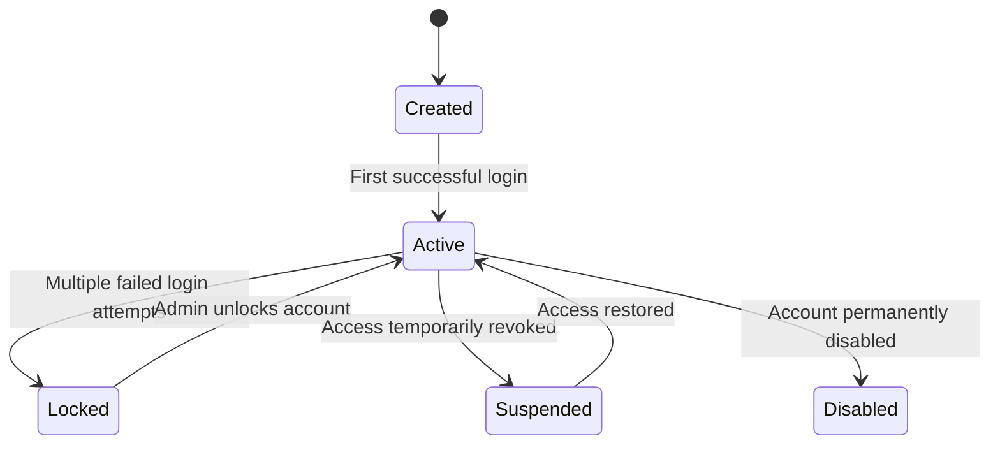
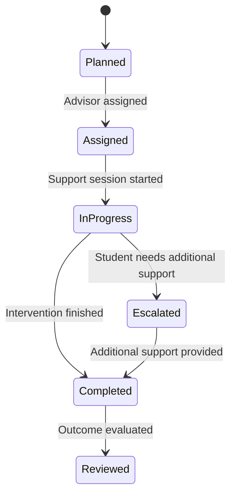

# State Transition Diagrams
## Student Early Warning System

---

### Critical objects:

- Student
- Attendance Record
- Grade Record
- Risk Status
- Alert
- Intervention Record
- User Account
- Dashboard Session

#### 1. Student State Diagram

Explanation

Key States

Registered
Active
AtRisk
Supported
Improved

Key Transitions

Registered → Active: student account activated
Active → AtRisk: attendance < 70% or grade < 50%
AtRisk → Supported: advisor intervention recorded
Supported → Improved: performance improves
Improved → Active: risk cleared

Mapping to Functional Requirements

FR5: Risk Detection
FR9: Advisor Monitoring
FR8: Student View Access

#### 2. Attendance Record State Diagram

Explanation

Key States

Created: The attendance record has been generated.
PendingReview: The submitted attendance is awaiting confirmation.
Validated: The attendance has been confirmed as correct.
Rejected: The attendance record contains errors or missing values.
Archived: The attendance record is no longer active and has been stored for history.

Key Transitions

Created → PendingReview when attendance is submitted.
PendingReview → Validated when the lecturer confirms the record.
PendingReview → Rejected if the data is incomplete or incorrect.
Rejected → PendingReview after correction and resubmission.
Validated → Archived at the end of the academic period.

Mapping to Functional Requirements

FR3: Attendance Recording is reflected in the creation and submission of attendance records.
FR10: Data Storage is reflected in the transition to Archived.

#### 3. Grade Record State Diagram

Explanation

Key States

Draft: The grade record is being prepared.
Submitted: The grades have been uploaded to the system.
Approved: The grade record has been verified as correct.
Rejected: The grades contain errors or incomplete information.
Archived: The final grade record is stored for future reference.

Key Transitions

Draft → Submitted when the lecturer uploads grades.
Submitted → Approved when the grades are verified.
Submitted → Rejected when errors are found.
Rejected → Draft when corrections are required.
Approved → Archived when the grades are finalized.

Mapping to Functional Requirements

FR4: Grade Management is reflected in the upload and approval of grades.
FR10: Data Storage is reflected in the final archived state.

#### 4. Risk Status State Diagram

Key States

Normal: The student is performing within acceptable thresholds.
UnderReview: The system is evaluating updated academic data.
AtRisk: The student has been identified as academically at risk.
Critical: The student’s performance has worsened significantly.
Monitored: The student is being observed after intervention begins.
Resolved: The academic risk has been addressed successfully.

Key Transitions

Normal → UnderReview when new academic data is received.
UnderReview → AtRisk if thresholds are not met.
UnderReview → Normal if performance remains acceptable.
AtRisk → Critical if performance continues to decline.
AtRisk → Monitored when support starts.
Monitored → Resolved when the student improves.
Critical → Monitored when intervention is initiated.
Resolved → Normal when the student stabilizes academically.

Mapping to Functional Requirements

FR5: Risk Detection is central to this object lifecycle.
FR9: Advisor Monitoring is reflected in the movement to Monitored.

#### 5. Alert State Diagram

Explanation

Key States

Generated: The alert has been created by the system.
Sent: The alert has been delivered to users.
Acknowledged: A lecturer or advisor has seen the alert.
Actioned: A response or intervention has started.
Expired: The alert was not responded to in time.
Closed: The alert is no longer active.

Key Transitions

Generated → Sent when the system pushes the alert to the dashboard.
Sent → Acknowledged when a user views the alert.
Acknowledged → Actioned when follow-up begins.
Sent → Expired if no action is taken in time.
Actioned → Closed when the issue is handled.
Expired → Closed when the alert is no longer relevant.

Mapping to Functional Requirements

FR7: Alert Notification is directly represented in this lifecycle.
FR6: Dashboard Display supports alert visibility and acknowledgment.

#### 6. Intervention Record State Diagram

Explanation

Key States

Created: The account has been registered in the system.
Active: The user can log in and use the system.
Locked: The account is temporarily locked due to failed logins.
Suspended: Access has been temporarily revoked.
Disabled: The account can no longer be used.

Key Transitions

Created → Active after first successful login.
Active → Locked after multiple failed login attempts.
Locked → Active when an administrator unlocks the account.
Active → Suspended when access is temporarily revoked.
Suspended → Active when access is restored.
Active → Disabled when the account is permanently disabled.

Mapping to Functional Requirements

FR1: User Authentication is reflected in account activation and locking.
FR10: Data Storage supports account persistence and account state management.

#### 7. User Account State Diagram

Explanation

Key States

Planned: The intervention has been identified but not yet assigned.
Assigned: An academic advisor has been assigned to handle it.
InProgress: The intervention is being carried out.
Completed: The intervention activities have been completed.
Escalated: The student requires further or higher-level support.
Reviewed: The intervention outcome has been evaluated.

Key Transitions

Planned → Assigned when an advisor is assigned.
Assigned → InProgress when support begins.
InProgress → Completed when the intervention finishes.
InProgress → Escalated when additional support is required.
Escalated → Completed once further support is delivered.
Completed → Reviewed when the results are evaluated.

Mapping to Functional Requirements

FR9: Advisor Monitoring is represented through advisor assignment and support tracking.
FR6: Dashboard Display may support visibility of intervention progress.

### State Diagrams Traceability

| Object | Functional Requirements | User Stories |
|---|---|---|
| Student | FR1, FR5, FR8, FR9 | US-001, US-006, US-009 |
| Attendance Record | FR3, FR10 | US-003 |
| Grade Record | FR4, FR10 | US-004 |
| Risk Status | FR5, FR9 | US-009 |
| Alert | FR6, FR7 | US-002, US-010 |
| User Account | FR1, FR10 | US-001 |
| Intervention Record | FR6, FR9 | US-007 |

