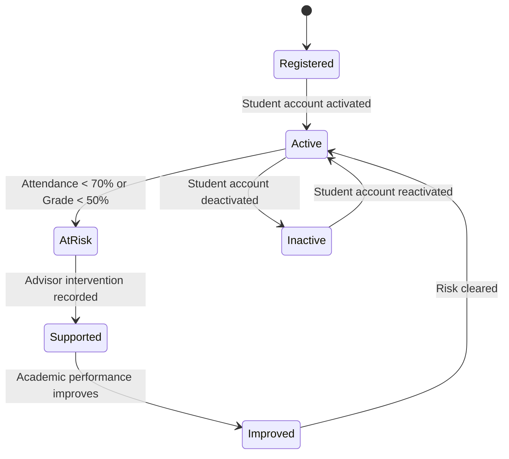
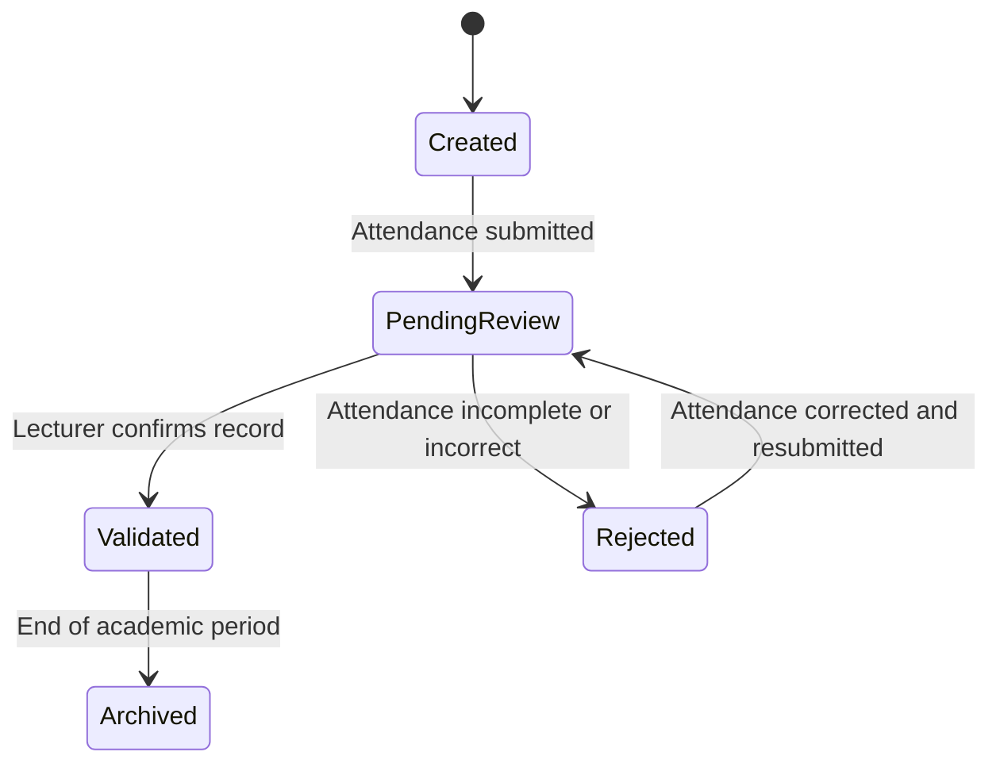
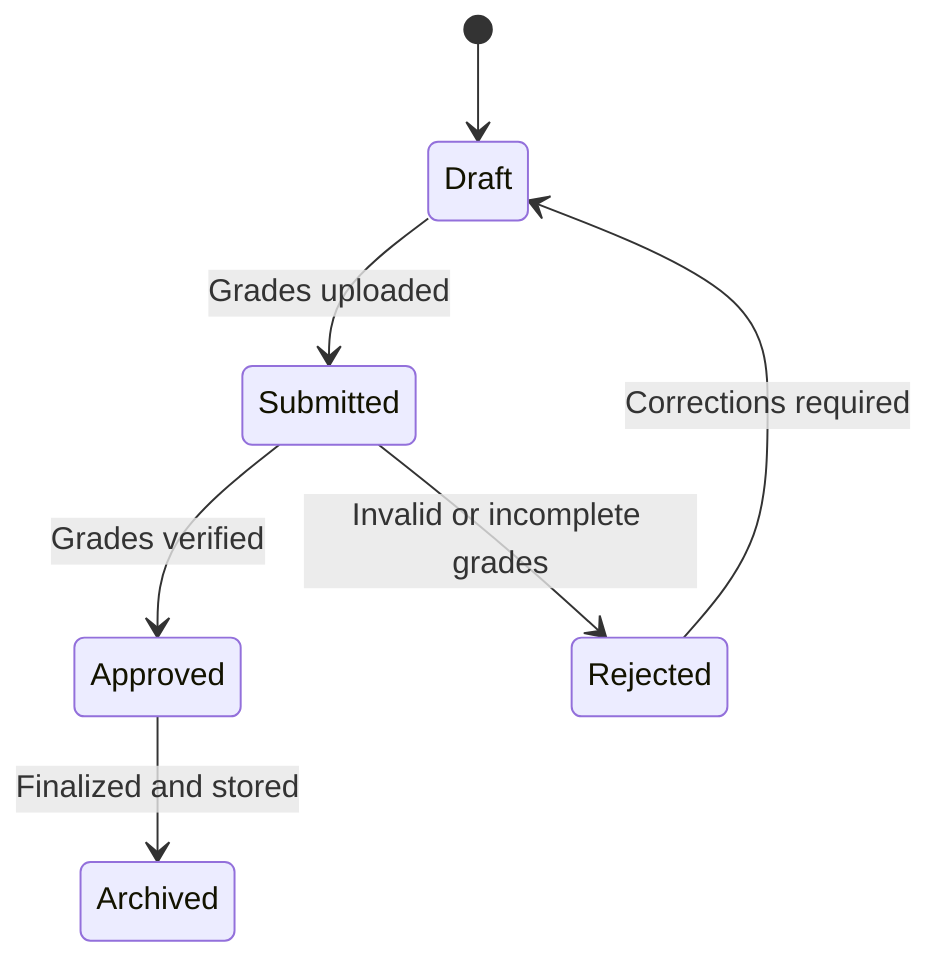
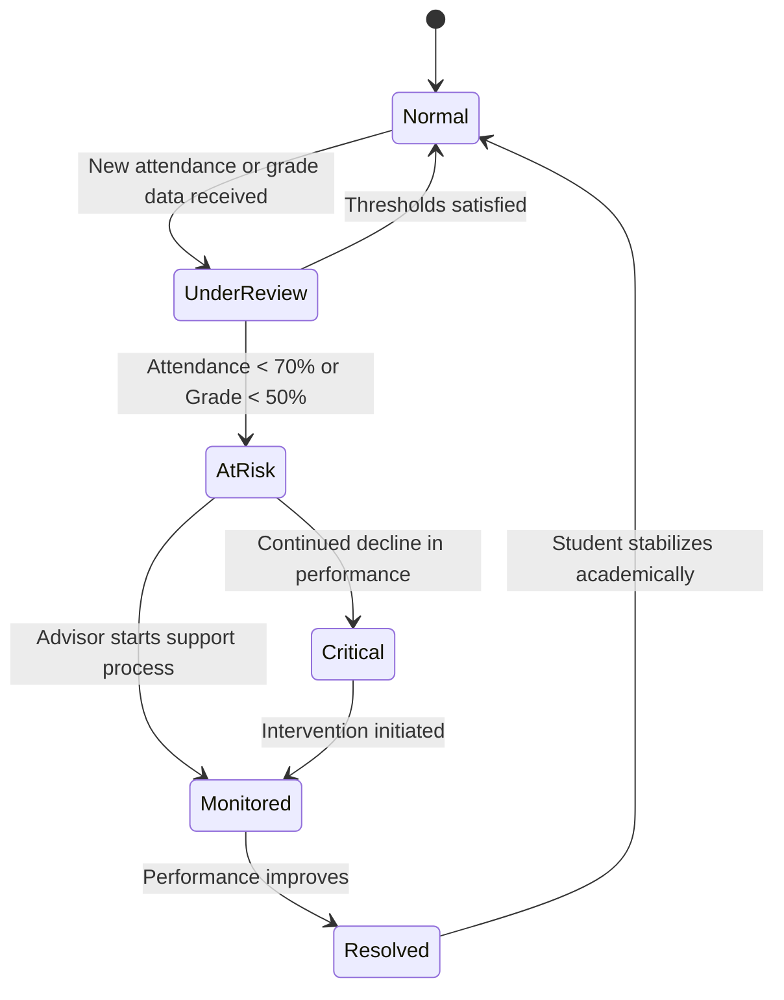
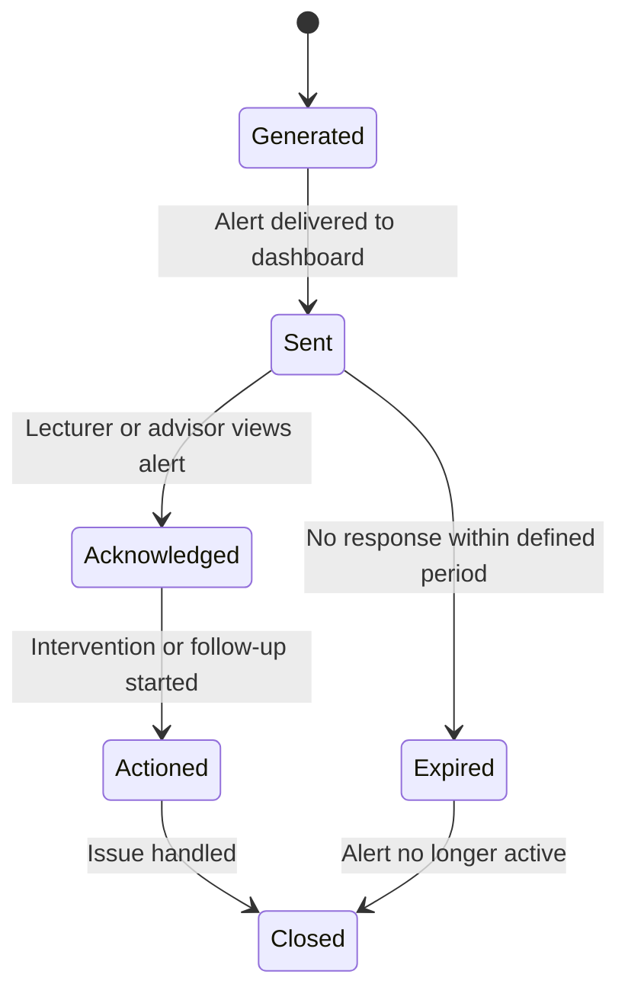
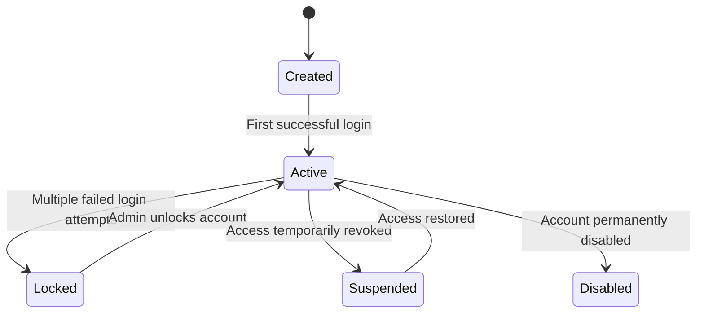
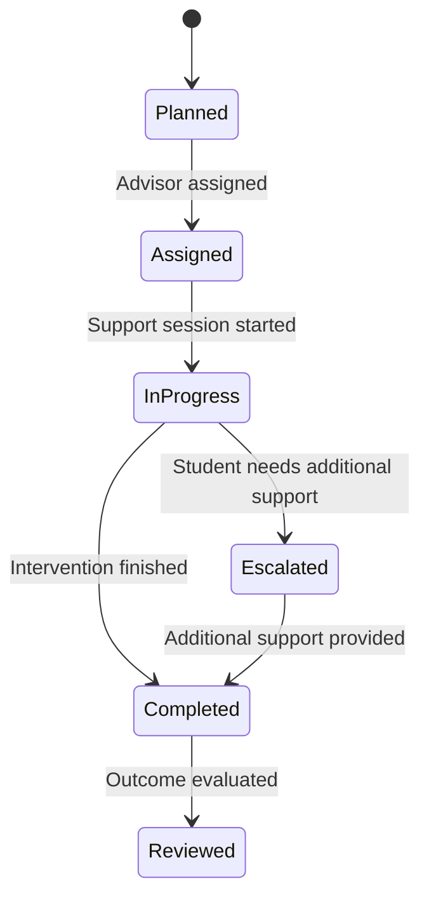

# State Transition Diagrams
## Student Early Warning System

---

## 1. Student State Diagram

Explanation

Key States

Registered
Active
AtRisk
Supported
Improved

Key Transitions

Registered → Active: student account activated
Active → AtRisk: attendance < 70% or grade < 50%
AtRisk → Supported: advisor intervention recorded
Supported → Improved: performance improves
Improved → Active: risk cleared

Mapping to Functional Requirements

FR5: Risk Detection
FR9: Advisor Monitoring
FR8: Student View Access

