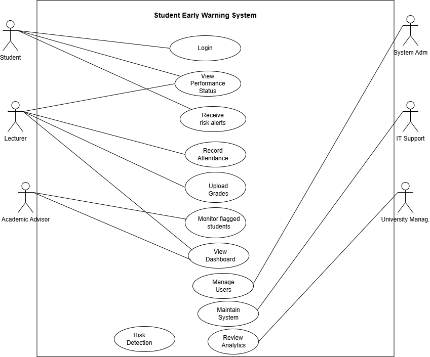

## Use Case Diagram

## Use Case Diagram

## Use Case Diagram Explanation

The use case diagram represents how different stakeholders interact with the Student Early Warning System to monitor academic performance and identify students who may be at risk.

### Key Actors and Their Roles

**Student**
The student is a primary user of the system. Students can log into the system, view their academic performance, and receive alerts when they are identified as at risk. This addresses the stakeholder concern of improving awareness of academic standing.

**Lecturer**
Lecturers are responsible for capturing academic data. They record attendance, upload grades, and monitor student performance through the dashboard. Their interaction with the system ensures that academic data is continuously updated, which supports accurate risk detection.

**Academic Advisor**
Academic advisors use the system to monitor students who have been flagged as at risk. They review student performance and provide appropriate academic interventions. This directly addresses the need for early support and improved student retention.

**System Administrator**
The system administrator manages user accounts and system access. This ensures that the system operates securely and efficiently.

**IT Support Staff**
IT support staff maintain the system, ensuring it is functional, reliable, and available for users. Their role supports system performance and uptime.

**University Management**
University management interacts with the system to review analytics and reports related to student performance and institutional outcomes. This helps in decision-making and improving academic success rates.

---

### Key Use Cases and Their Purpose

- **Login:** Allows all users to securely access the system.
- **Record Attendance:** Enables lecturers to capture student attendance data.
- **Upload Grades:** Allows lecturers to record assessment results.
- **Risk Detection:** The system evaluates attendance and grades to identify at-risk students.
- **Generate Alerts:** Alerts are created when students are flagged as at risk.
- **View Dashboard:** Displays academic performance and risk status for monitoring.
- **Monitor Flagged Students:** Academic advisors review students identified as at risk.
- **Provide Intervention:** Advisors take action to support struggling students.
- **Manage Users:** Administrators control user access and system roles.
- **Generate Reports:** Provides summaries for institutional analysis.
- **Maintain System:** Ensures the system is operational and maintained.
- **Review Analytics:** Allows management to analyze trends and performance.

---

### Relationships Between Use Cases

The diagram includes important relationships that show how the system functions internally:

- **<<include>> relationships** are used where one use case depends on another.
  - *Record Attendance* and *Upload Grades* both include *Risk Detection* because new academic data triggers analysis.
  - *Risk Detection* includes *Generate Alerts* since alerts are produced after identifying at-risk students.

- The interaction between **Monitor Flagged Students** and **Provide Intervention** shows how identified risks lead to action.

---

### Alignment with Stakeholder Concerns

The use case diagram directly addresses stakeholder needs identified in Assignment 4:

- Students receive timely alerts, improving awareness of academic performance.
- Lecturers reduce manual tracking by using automated monitoring tools.
- Academic advisors can intervene earlier, improving student outcomes.
- University management gains access to reports and analytics for decision-making.
- IT staff and administrators ensure system reliability and security.

---

### Conclusion

The use case diagram demonstrates how the Student Early Warning System supports end-to-end academic monitoring. It shows how data is captured, processed, and used to identify at-risk students and enable timely intervention. The interactions between actors and use cases ensure that the system meets both functional requirements and stakeholder expectations.

---

## Use Case Specifications

### Use Case 1: User Login
**Actor:** All users  
**Precondition:** User has valid credentials  
**Postcondition:** User is logged into system  

**Basic Flow:**
1. User enters username and password  
2. System validates credentials  
3. System grants access  

**Alternative Flow:**
- Invalid credentials → access denied  

---

### Use Case 2: Record Attendance
**Actor:** Lecturer  
**Precondition:** Lecturer is logged in  
**Postcondition:** Attendance stored  

**Basic Flow:**
1. Lecturer selects class  
2. Marks attendance  
3. System saves data  

---

### Use Case 3: Upload Grades
**Actor:** Lecturer  

**Basic Flow:**
1. Lecturer uploads grades  
2. System stores results  

---

### Use Case 4: Risk Detection
**Actor:** System  

**Basic Flow:**
1. System checks attendance  
2. System checks grades  
3. Flags at-risk students  

---

### Use Case 6: View Dashboard
**Actor:** Lecturer  

**Basic Flow:**
1. Lecturer logs in  
2. Views student performance  

---

### Use Case 7: Monitor Students
**Actor:** Academic Advisor  

**Basic Flow:**
1. Advisor logs in  
2. Views flagged students  

---

### Use Case 8: Provide Intervention
**Actor:** Academic Advisor  

**Basic Flow:**
1. Advisor reviews student  
2. Records intervention  